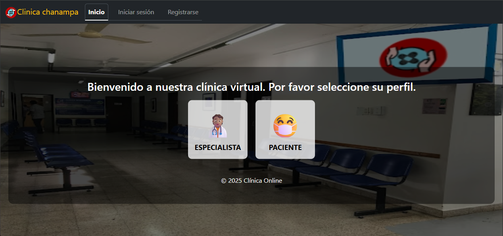
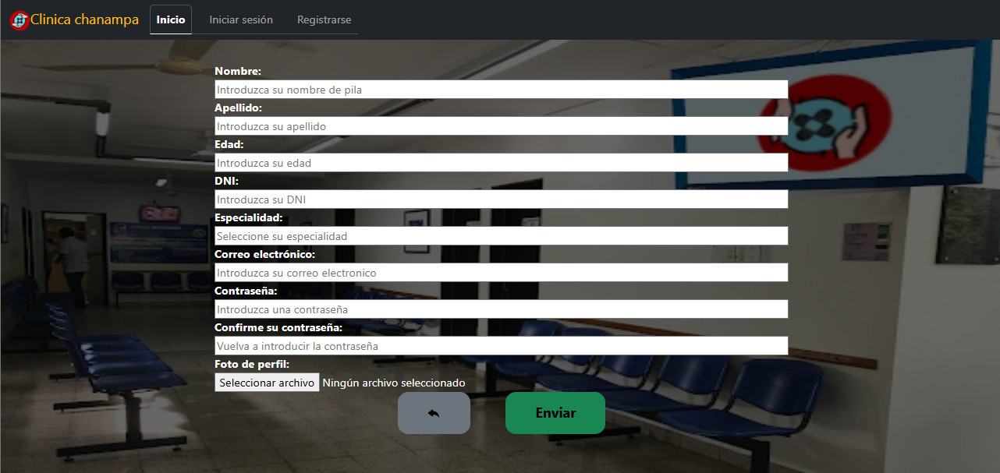
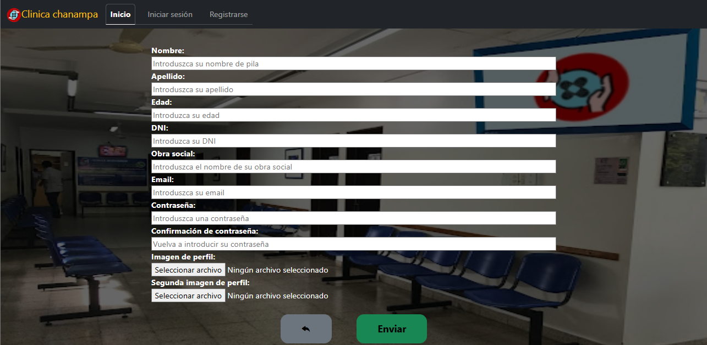

# CLINICA ONLINE

    

---

    
    
    
    
    
    

---

## Alumna: Macarena nicole chanampa 

## ÍNDICE
* [página de inicio](#paginaInicio)
* [Página de registro](#paginaRegistro)
* [Registro de especialista](#registroEspecialistas)
* [Registro de paciente](#registroPacientes)

---

## PáGINA DE INICIO

### Desde aquí las personas son recibidas e indicadas a realizar ya sea el inicio de sesión o el registro para acceder a la clínica online.

---

## PáGINA DE REGISTRO

### Desde esta página de registro dependiendo del perfil, se podrán inscribir tanto los pacientes como los especialistas que vayan a trabajar en la clínica.

---

## PÁGINA DE REGISTRO DE ESPECIALISTAS

### Desde aquí se pueden registrar los especialistas, y al completar los datos, deben esperar hasta que los administradores los habiliten.

---

## PáGINA DE REGISTRO DE PACIENTES

### Desde aquí se pueden registrar los pacientes, y al completar los datos. Ya podrán solicitar turnos y gestionarlos.

