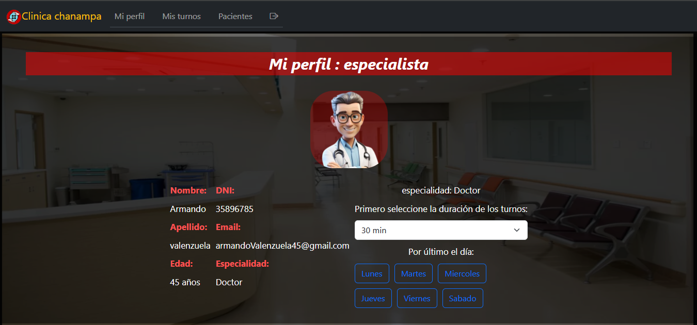

# CLINICA ONLINE

    

---

    
    
    
    
    
    

---

## Alumna: Macarena nicole chanampa 

## ÍNDICE
- [PáGINA DE INICIO](#paginaInicio)
- [PÁGINA DE INICIO DE SESIÓN](#paginaInicioSesion)
- [PáGINA DE REGISTRO](#paginaRegistro)
- [REGISTRO DE ESPECIALISTAS](#registroEspecialistas)
- [REGISTRO DE PACIENTES](#registroPacientes)
- ['MI PERFIL' DE PACIENTE](#perfilPaciente)
- ['MI PERFIL' DE ESPECIALISTA](#perfilEspecialista)
- ['MI PERFIL' DE ADMINISTRADOR](#perfilAdministrador)

---

## PáGINA DE INICIO

### Desde aquí las personas son recibidas e indicadas a realizar ya sea el inicio de sesión o el registro para acceder a la clínica online.

---

## PÁGINA DE INICIO DE SESIÓN

### aquí es donde pueden ingresar tanto pacientes, especialistas y administradores. Para ingresar, debe hacer una mini prueba con captcha.

---

## PáGINA DE REGISTRO

### Desde esta página de registro dependiendo del perfil, se podrán inscribir tanto los pacientes como los especialistas que vayan a trabajar en la clínica.

---

## REGISTRO DE ESPECIALISTAS

### Desde aquí se pueden registrar los especialistas, y al completar los datos, deben esperar hasta que los administradores los habiliten.

---

## REGISTRO DE PACIENTES

### Desde aquí se pueden registrar los pacientes, y al completar los datos. Ya podrán solicitar turnos y gestionarlos.

---

## 'MI PERFIL' DE PACIENTE

### Desde está sección se podran visualizar los datos del paciente que ingreso. Como su nombre, apellido, imágenes, etc.

---

## 'MI PERFIL' DE ESPECIALISTA

### Desde está sección se podran visualizar los datos del especialista que ingresa y también podra seleccionar su horario dependiendo de su especialidad.

---

## 'MI PERFIL' DE ADMINISTRADOR

### Desde está sección se podran visualizar los datos del administrador que se logueo.

---

---

