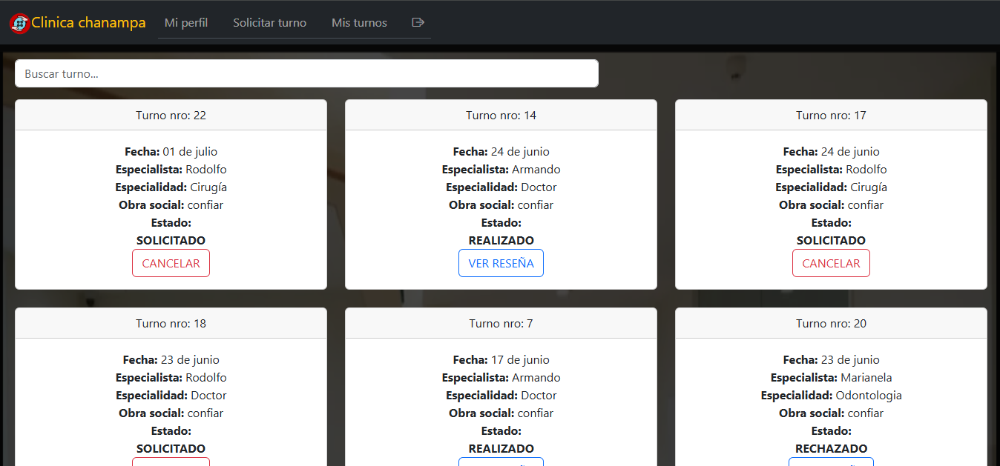
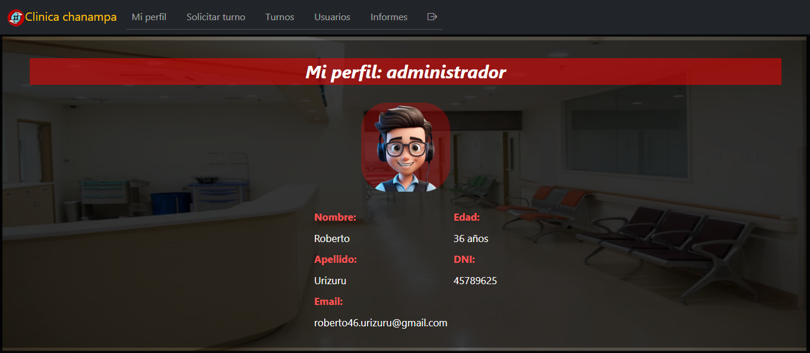
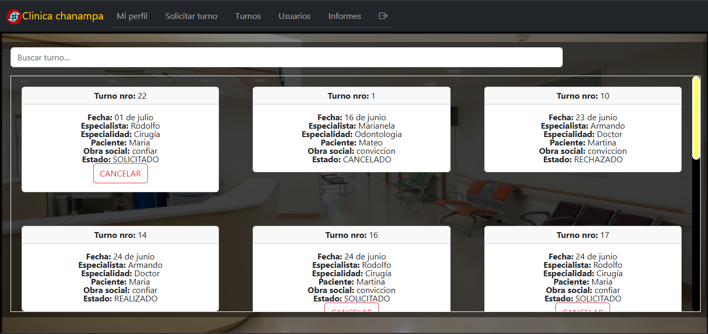

# CLINICA ONLINE

    

---

    
    
    
    
    
    

---

## Alumna: Macarena nicole chanampa 

## PáGINA DE INICIO

### Desde aquí las personas son recibidas e indicadas a realizar ya sea el inicio de sesión o el registro para acceder a la clínica online.

---

## PÁGINA DE INICIO DE SESIÓN

### aquí es donde pueden ingresar tanto pacientes, especialistas y administradores. Para ingresar, debe hacer una mini prueba con captcha.

---

## PáGINA DE REGISTRO

### Desde esta página de registro dependiendo del perfil, se podrán inscribir tanto los pacientes como los especialistas que vayan a trabajar en la clínica.

---

## REGISTRO DE ESPECIALISTAS

### Desde aquí se pueden registrar los especialistas, y al completar los datos, deben esperar hasta que los administradores los habiliten.

---

## REGISTRO DE PACIENTES

### Desde aquí se pueden registrar los pacientes, y al completar los datos. Ya podrán solicitar turnos y gestionarlos.

---

# SECCION DE PACIENTE

## 'MI PERFIL' DE PACIENTE

### Desde está sección se podran visualizar los datos del paciente que ingreso. Como su nombre, apellido, imágenes, etc.

## HISTORIAL CLINICO

### al presionar el boton, el paciente puede descargar todo el historial clinico de una especialidad o descargar el historial clinico de un turno en particular.

## SOLICITAR TURNO
## Desde está sección se puede solicitar un turno, eligiendo especialidad, especialista, día disponible del especialista elegido y un horario disponible

## MIS TURNOS
### Desde está seccion el paciente puede ver los turnos que tiene y saber su estado y puede cancelar un turno en particular.

---

# SECCION DE ESPECIALISTA

## 'MI PERFIL' DE ESPECIALISTA
### Desde está sección se podran visualizar los datos del especialista que ingresa y también podra seleccionar su horario dependiendo de su especialidad.

## HORARIOS
### Desde está seccion que se encuentra en el perfil kel especialista puede agregar o actualizar sus horarios

## MIS TURNOS
### Desde está seccion el especialista puede ver los turnos que tiene y saber su estado y lo que puede hacer, ya sea, cancelarlo, rechazarlo o aceptarlo.

## PACIENTES
### Desde está seccion el especialista visualiza los datos de los pacientes a los que atendio al menos una ves.

---

# SECCION DE ADMINISTRADOR

## 'MI PERFIL' DE ADMINISTRADOR

### Desde está sección se podran visualizar los datos del administrador que se logueo.

## SOLICITAR TURNO

### Desde está sección el administrador puede solicitar turno para alguno de los pacientes ya registrados, luego elige especialidad, especialista, fecha y horario.

## TURNOS

### Desde está sección se puede visualizar  una lista de los turnos que solicitaron los pacientes y los que solicito el administrador mismo.

## USUARIOS

## Desde está sección el administrador visualiza los administradores, especialistas y pacientes registrados. También puede habilitar o deshabilitar especialistas.

## INFORMES

### Desde está sección el administrador puede visualizar una lista de logs de los usuarios que ingresaron al sistema, y también gráficos.

---
